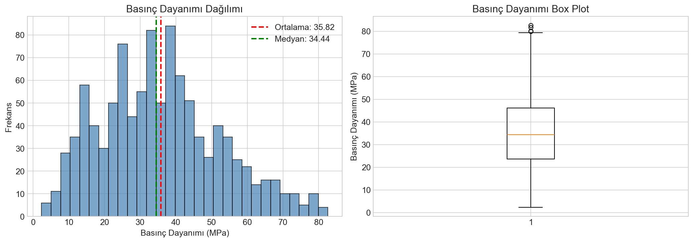
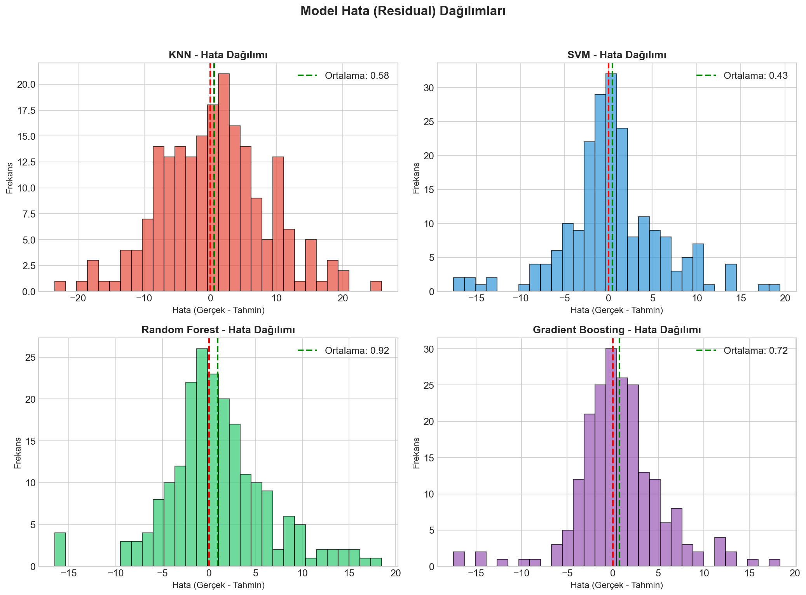

# BETON BASINÇ DAYANIMI TAHMİNİ
## Makine Öğrenmesi ile Regresyon Analizi

**Öğrenci:** [İsminizi Yazın]  
**Numara:** [Numaranızı Yazın]  
**Ders:** [Ders Adı]  
**Tarih:** Aralık 2024

---

## 1. GİRİŞ

Bu çalışmada, beton karışımının bileşenlerini kullanarak betonun basınç dayanımını tahmin etmek amacıyla farklı makine öğrenmesi modelleri uygulanmıştır. Concrete Compressive Strength veri seti kullanılarak KNN, SVM, Random Forest ve Gradient Boosting regresyon modelleri karşılaştırılmıştır.

### 1.1 Amaç
- Beton basınç dayanımını etkileyen faktörleri analiz etmek
- Farklı makine öğrenmesi modellerinin performansını karşılaştırmak
- En iyi tahmin modelini belirlemek

### 1.2 Veri Seti
- **Kaynak:** UCI Machine Learning Repository
- **Örnek Sayısı:** 1030
- **Özellik Sayısı:** 8 giriş özelliği + 1 hedef değişken

---

## 2. VERİ SETİ ÖZELLİKLERİ

| Özellik | Açıklama | Birim |
|---------|----------|-------|
| Çimento | Çimento miktarı | kg/m³ |
| Cüruf | Yüksek fırın cürufu | kg/m³ |
| Uçucu Kül | Uçucu kül miktarı | kg/m³ |
| Su | Su miktarı | kg/m³ |
| Süperplastik | Süperplastikleştirici | kg/m³ |
| Kaba Agrega | Kaba agrega miktarı | kg/m³ |
| İnce Agrega | İnce agrega miktarı | kg/m³ |
| Yaş | Betonun yaşı | gün |
| **Basınç Dayanımı** | **Hedef değişken** | **MPa** |

---

## 3. KEŞİFSEL VERİ ANALİZİ (EDA)

### 3.1 Hedef Değişken Dağılımı

Basınç dayanımı değerleri incelendiğinde:
- **Ortalama:** 35.82 MPa
- **Medyan:** 34.44 MPa
- **Minimum:** 2.33 MPa
- **Maksimum:** 82.60 MPa

Dağılım yaklaşık normal dağılıma sahiptir ve hafif sağa çarpıklık göstermektedir.

### 3.2 Korelasyon Analizi

Korelasyon ısı haritası incelendiğinde, basınç dayanımı ile en yüksek korelasyona sahip özellikler:

| Özellik | Korelasyon |
|---------|------------|
| Çimento | 0.50 |
| Süperplastik | 0.37 |
| Yaş | 0.33 |
| Su | -0.29 |

**Yorum:** Çimento miktarı, basınç dayanımı ile en güçlü pozitif korelasyona sahiptir. Su miktarı ise negatif korelasyon göstermektedir.

---

## 4. VERİ ÖN İŞLEME

### 4.1 Veri Bölme
- **Eğitim Seti:** %80 (824 örnek)
- **Test Seti:** %20 (206 örnek)
- **Random State:** 42 (tekrarlanabilirlik için)

### 4.2 Normalizasyon
Tüm özellikler **StandardScaler** kullanılarak normalize edilmiştir:
- Ortalama: 0
- Standart Sapma: 1

Bu işlem, özellikle KNN ve SVM gibi mesafe tabanlı algoritmaların daha iyi performans göstermesini sağlar.

---

## 5. KULLANILAN MODELLER

### 5.1 K-Nearest Neighbors (KNN)
- **Algoritma:** Mesafe tabanlı komşuluk yaklaşımı
- **K Değeri:** Optimum K değeri cross-validation ile belirlendi
- **Mesafe Metriği:** Öklid mesafesi

### 5.2 Support Vector Machine (SVM)
- **Kernel:** RBF (Radial Basis Function)
- **C Parametresi:** 100
- **Gamma:** scale

### 5.3 Random Forest
- **Ağaç Sayısı:** 100
- **Maksimum Derinlik:** 15
- **Min Samples Split:** 5

### 5.4 Gradient Boosting
- **Ağaç Sayısı:** 100
- **Öğrenme Oranı:** 0.1
- **Maksimum Derinlik:** 5

---

## 6. SONUÇLAR

### 6.1 Performans Metrikleri

| Model | MSE | RMSE | MAE | R² |
|-------|-----|------|-----|-----|
| KNN | 66.21 | 8.14 | 6.38 | 0.7430 |
| SVM | 32.83 | 5.73 | 3.99 | 0.8726 |
| Random Forest | 31.65 | 5.63 | 4.01 | 0.8772 |
| **Gradient Boosting** | **23.81** | **4.88** | **3.40** | **0.9076** |

### 6.2 Model Sıralaması (R² Skoruna Göre)

🥇 **1. Gradient Boosting:** R² = 0.9076  
🥈 **2. Random Forest:** R² = 0.8772  
🥉 **3. SVM:** R² = 0.8726  
4️⃣ **4. KNN:** R² = 0.7430

### 6.3 Gerçek vs Tahmin Grafikleri

Grafikler incelendiğinde, Gradient Boosting modelinin tahminlerinin gerçek değerlere en yakın olduğu görülmektedir.

### 6.4 Hata Dağılımları

Tüm modellerin hata dağılımları sıfır etrafında yoğunlaşmıştır, bu da modellerin sistematik bir sapma göstermediğini belirtir.

---

## 7. TARTIŞMA VE YORUM

### 7.1 Model Performans Değerlendirmesi

1. **Gradient Boosting** en yüksek performansı göstermiştir (R² = 0.9076). Bu model, beton basınç dayanımının varyansının %90.8'ini açıklayabilmektedir.

2. **Random Forest** ikinci en iyi performansı sergilemiştir. Ensemble yöntemlerinin bu veri seti için etkili olduğu görülmektedir.

3. **SVM** modeli, RBF kernel sayesinde doğrusal olmayan ilişkileri yakalayabilmiştir.

4. **KNN** en düşük performansı göstermiştir ancak yine de kabul edilebilir sonuçlar üretmiştir.

### 7.2 Özellik Önemi

Random Forest ve Gradient Boosting modelleri, özellik önemlerini hesaplama imkanı sunar. En önemli özellikler:
1. **Çimento** - En yüksek önem
2. **Yaş** - İkinci önemli
3. **Su** - Üçüncü önemli

### 7.3 Sonuç

Bu çalışmada, beton basınç dayanımının makine öğrenmesi yöntemleri ile başarılı bir şekilde tahmin edilebildiği gösterilmiştir. **Gradient Boosting** modeli, en düşük hata oranları ve en yüksek R² skoru ile en iyi performansı sergilemiştir.

---

## 8. KAYNAKLAR

1. UCI Machine Learning Repository - Concrete Compressive Strength Dataset
2. Scikit-learn Documentation
3. Yeh, I-C. (1998). Modeling of strength of high-performance concrete using artificial neural networks.

---

## EKLER

### Ek 1: Kullanılan Python Kütüphaneleri
- pandas
- numpy
- matplotlib
- seaborn
- scikit-learn

### Ek 2: Kod Deposu
Tüm kod ve analizler Jupyter Notebook formatında `beton_basinc_dayanimi_tahmini.ipynb` dosyasında mevcuttur.

