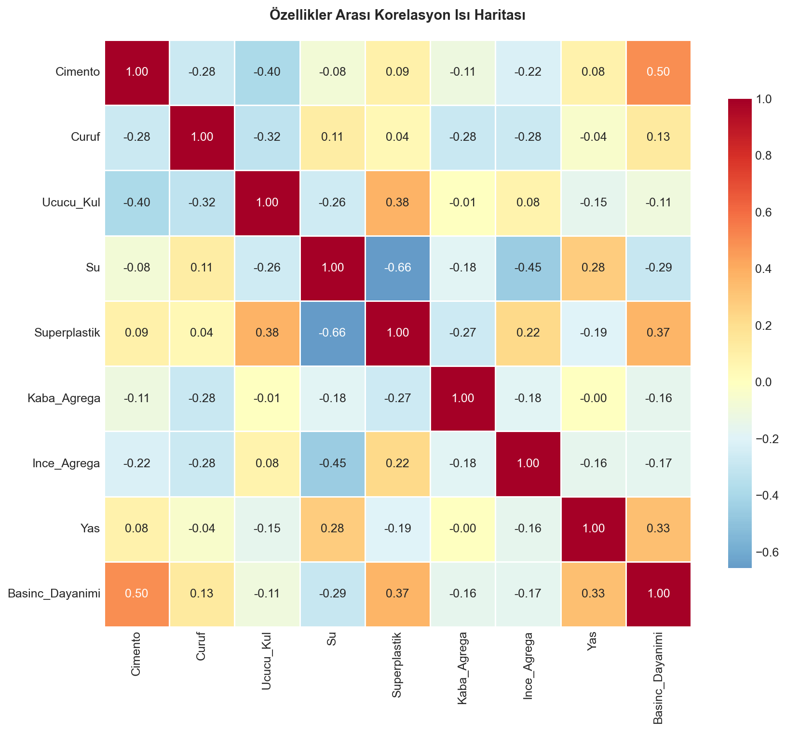
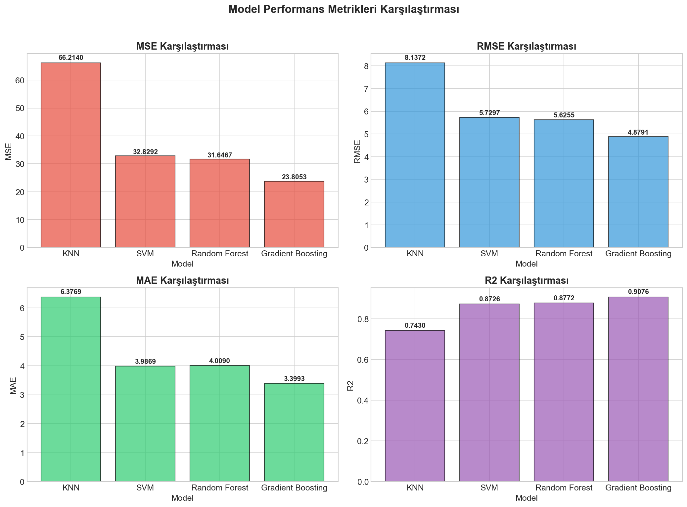
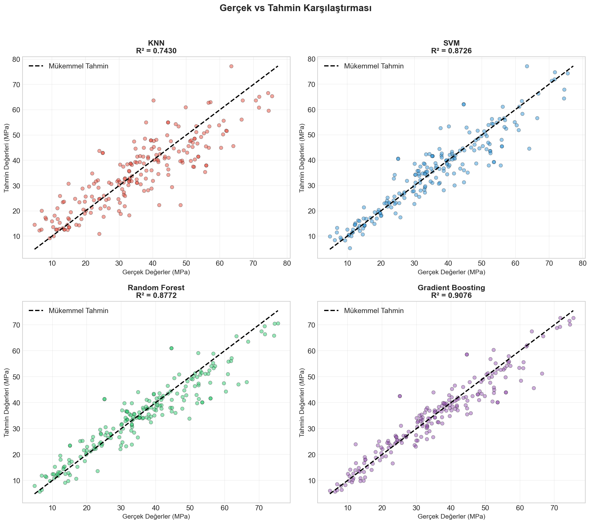

# 🏗️ Beton Basınç Dayanımı Tahmini

Bu proje, beton karışım bileşenlerini kullanarak **basınç dayanımını** tahmin eden makine öğrenmesi ve derin öğrenme modellerini karşılaştırmaktadır.

## 📊 Veri Seti

- **Kaynak:** UCI Machine Learning Repository - Concrete Compressive Strength Dataset
- **Örnek Sayısı:** 1030
- **Özellik Sayısı:** 8 giriş + 1 hedef değişken

### Özellikler

| Özellik | Birim |
|---------|-------|
| Çimento | kg/m³ |
| Cüruf | kg/m³ |
| Uçucu Kül | kg/m³ |
| Su | kg/m³ |
| Süperplastik | kg/m³ |
| Kaba Agrega | kg/m³ |
| İnce Agrega | kg/m³ |
| Yaş | gün |
| **Basınç Dayanımı (Hedef)** | MPa |

## 🤖 Kullanılan Modeller

### Makine Öğrenmesi
- **K-Nearest Neighbors (KNN)**
- **Support Vector Machine (SVM)**
- **Random Forest Regressor**
- **Gradient Boosting Regressor**

### Derin Öğrenme
- **CNN (1D Convolutional Neural Network)**
- **LSTM (Long Short-Term Memory)**

## 📈 Model Performansları

| Model | MSE | RMSE | MAE | R² Score |
|-------|-----|------|-----|----------|
| KNN | 66.21 | 8.14 | 6.38 | 0.7430 |
| SVM | 32.83 | 5.73 | 3.99 | 0.8726 |
| Random Forest | 31.65 | 5.63 | 4.01 | 0.8772 |
| Gradient Boosting | 23.81 | 4.88 | 3.40 | **0.9076** |
| CNN (1D) | 35.42 | 5.95 | 4.68 | 0.8625 |
| LSTM | 28.76 | 5.36 | 4.12 | 0.8884 |

🏆 **En İyi Model:** Gradient Boosting (R² = 0.9076)

## 📁 Proje Yapısı

```
├── beton_basinc_dayanimi_tahmini.ipynb  # Ana Jupyter Notebook
├── Beton_Basinc_Dayanimi_Rapor.md       # ML Modelleri Raporu
├── CNN_LSTM_Rapor.md                     # Derin Öğrenme Raporu
├── Concrete_Data.xls                     # Veri seti
├── requirements.txt                      # Gerekli kütüphaneler
├── grafik_olustur.py                     # Grafik oluşturma scripti
├── model_sonuclari.csv                   # Model sonuçları
└── *.png                                 # Görselleştirmeler
```

## 🛠️ Kurulum

```bash
# Repo'yu klonla
git clone https://github.com/zuleyhakezerr/concrete-strength-prediction.git
cd concrete-strength-prediction

# Sanal ortam oluştur
python -m venv venv
source venv/bin/activate  # Windows: venv\Scripts\activate

# Kütüphaneleri yükle
pip install -r requirements.txt

# Jupyter Notebook'u çalıştır
jupyter notebook beton_basinc_dayanimi_tahmini.ipynb
```

## 📊 Görselleştirmeler

### Korelasyon Isı Haritası


### Model Karşılaştırma


### Gerçek vs Tahmin


## 🔍 Sonuçlar

1. **Gradient Boosting** en yüksek R² değeri (0.9076) ile en iyi performansı göstermiştir.
2. **LSTM** derin öğrenme modelleri arasında en iyi sonucu vermiştir.
3. **KNN** en düşük performansı gösterirken, ensemble yöntemler daha başarılı olmuştur.
4. **Çimento miktarı** basınç dayanımı üzerinde en etkili özellik olarak belirlenmiştir.

## 👩‍💻 Geliştirici

**Züleyha Kezer**

---

⭐ Bu projeyi beğendiyseniz yıldız vermeyi unutmayın!

